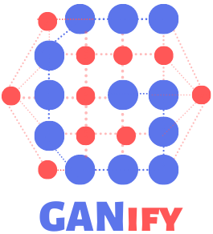
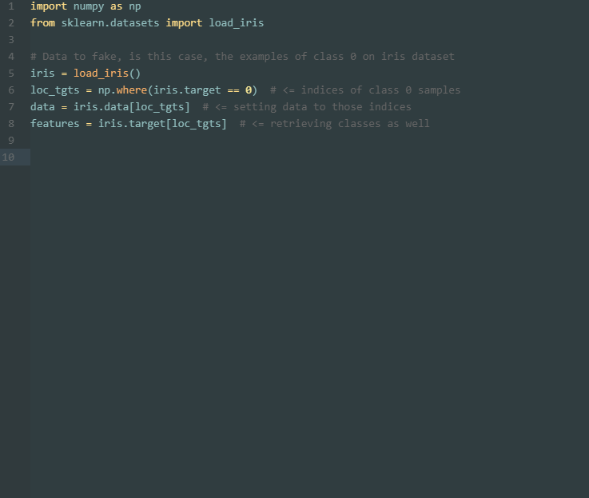

# GANify (v. 1.1.0)

<p align="center">

</p>

**GANify** amplifies a numeric table. It trains a generative adversarial network on rows from a single class and draws extra rows that stay inside the range of the data it saw. The name joins **GAN** with ampl**ify**.

Version 1.1.0 keeps that workflow and corrects the training loop, scaling, and sampling so the default Wasserstein model and the classic GAN model each optimize the objective they claim to optimize.

## Installation

```bash
pip install ganify==1.1.0
```

From a checkout:

```bash
pip install .
```

GANify needs Python 3.8 or newer, TensorFlow 2.2 or newer, NumPy, pandas, scikit-learn, matplotlib, and tqdm.

## Quick start

`y_train` has to contain one class. Filter first when the table is multi-class. The synthetic matrix does not include the label; it is kept on `y_label_` so you can attach it yourself.

```python
import numpy as np
import pandas as pd
from ganify import Ganify

rng = np.random.default_rng(0)
frame = pd.DataFrame(
    {
        "age": rng.normal(40, 8, size=256),
        "income": rng.normal(50_000, 5_000, size=256),
        "score": rng.normal(0, 1, size=256),
        "segment": np.full(256, 7.0),
    }
)
frame["target"] = 1

features = frame.drop(columns="target")
target = frame["target"]

model = Ganify(random_state=42)
model.fit_data(
    features,
    target,
    type="wgan",
    epochs=50,
    batch_size=32,
    patience=10,
)
synthetic = model.create_bulk(500, output=1)
synthetic["target"] = model.y_label_
model.plot_performance(path="ganify_loss.png", show=False)
model.save("ganify_model")

restored = Ganify.load("ganify_model")
more = restored.create_bulk(length=100, output=1)
```

`create_bulk(1000, 1)` still works. `length` is the preferred spelling, and `lenght` remains accepted.

<p align="center">

</p>

The animation is the original walkthrough. The class exported by the package is `Ganify`, and the target has to be a single class.

## What you get back

- Each numeric column of a synthetic row lies between that column's training minimum and maximum.
- A column that never varied in the training rows is copied back exactly, including after `save` and `load`.
- One-dimensional input is treated as one feature.
- A dataframe supplies column names, so `create_bulk(..., output=1)` round-trips them. NumPy input needs `cols_names` for a dataframe result.
- `critic_scores_` holds the critic or discriminator score of each drawn row. Lower is not automatically better; the scores are a diagnostic.
- `history_["real"]`, `history_["fake"]`, and `history_["generator"]` are the per-step losses. Each point is the mean of that step only.

`type="wgan"` trains a weight-clipped critic with RMSprop and labels of -1 for real rows and +1 for generated rows. `type="gan"` trains a sigmoid discriminator with binary cross-entropy and labels of 1 and 0. About 5% of adversary labels are flipped per row (`label_flip`). The generator is a tanh MLP. Hidden width grows with the number of features and is capped at `max_units` (default 512) so a wide table does not build an unbounded network.

An epoch shuffles the rows and visits each row once. A trailing single row is folded into the previous batch. Pass `patience` to stop after that many epochs without a sufficient drop in generator loss. `plot_performance(path=..., show=False)` writes the curves without opening a window.

`Ganify(random_state=42)` makes a fit repeatable. Construction does not reseed NumPy. `fit_data` seeds TensorFlow and uses a private NumPy generator for shuffling, noise, and label flips.

## Classic GAN

```python
model.fit_data(features, target, type="gan", epochs=50, batch_size=32)
```

Use the loss plot and a downstream check on your own task before treating the rows as real data. A finite loss only means the optimization step ran.

## Save and load

`save` writes a directory with the generator weights, the adversary weights, the scaler, and `metadata.json`. `Ganify.load` restores generation, scores, column names, `y_label_`, and the loss history. Sampling starts again from `random_state`, so two loads draw the same first batch.

## Limits

- One class per model. Train a separate model for each class you want to amplify.
- Features must be real numbers. Encode categories before calling `fit_data`. Numeric strings and booleans in a dataframe are coerced to floats.
- Rows with NaN or infinite values are rejected.
- Synthetic values cannot fall outside the training min and max of a column, and they can still combine values that never occurred together.
- This is not a privacy mechanism. The generator can memorize training rows.
- At least two rows are required. `batch_size` larger than the table is reduced to a single batch per epoch and a warning is emitted.

## Tests

```bash
python -m unittest discover -s tests -v
```

## What changed in 1.1.0

- The GAN path uses 0/1 labels and binary cross-entropy. The WGAN path keeps the Wasserstein labels and clips every critic kernel and bias to [-0.01, 0.01] after each update.
- Generator and adversary steps use separate optimizers. Generated rows shown to the adversary are detached from the generator.
- The generator is a plain MLP. Dropout and batch normalization were removed so sampling uses the same function that was trained. That matters for the small batches this library is aimed at.
- Epochs cover the rows without replacement. Loss history stores each step, not a cumulative average.
- Scaling preserves constant columns and refuses non-finite input. One-hot targets with a single repeated row are recognized as one class.
- `create_bulk` generates in batches, `save` / `load` persist a fitted model, and early stopping is available through `patience`.
- Public imports no longer re-export TensorFlow or scikit-learn symbols.

## References

- Goodfellow et al., "Generative Adversarial Nets", 2014. https://arxiv.org/pdf/1406.2661.pdf
- Arjovsky, Chintala, and Bottou, "Wasserstein GAN", 2017. https://arxiv.org/abs/1701.07875
- Roth, Lucchi, Nowozin, and Hofmann, "Stabilizing Training of Generative Adversarial Networks through Regularization", 2017. https://papers.nips.cc/paper/6797-stabilizing-training-of-generative-adversarial-networks-through-regularization.pdf
- Salimans et al., "Improved Techniques for Training GANs", 2016. https://arxiv.org/abs/1606.03498

Thanks to Jason Brownlee at Machine Learning Mastery, whose WGAN walkthrough informed the original package: https://machinelearningmastery.com/
